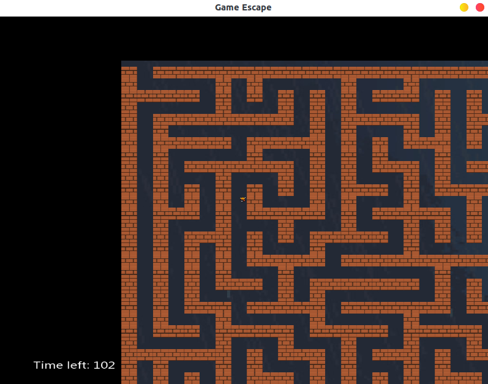

# JAM_escape_2019

This is my GameJam done with [Valentinbreiz](https://github.com/valentinbreiz) and Leozou.

Theme of the Jam: **Escape**

## Prerequisites

- SFML library

```bash
sudo apt-get install libsfml-dev
```

## Run

Compile the project
```bash
make
```

Exec binary
```
./escape
```

## Game description
A maze is procedurally generated each time you start the game.
Your goal is to find the exit before time runs out



